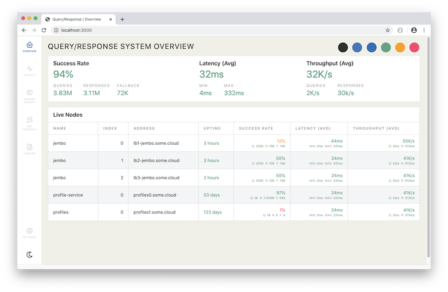
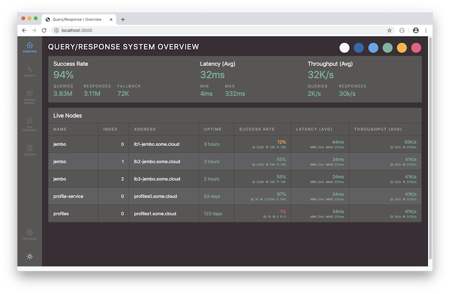

Query/Response UI
=================

**WIP: Driving the goals and implementation of the UI with this README, please
       feel free to provide feedback and ideas through issues.**

The Query/Response UI helps you gain insights and observe your service
landscape by providing rich information about how queries and responses are
flowing through the system.

Getting started
---------------

The Query/Response UI joins the messaging network, and is _eating its own dog
food_ by using queries to gather information about the current system.

The simplest way to start the UI is to run it locally by issuing `make`. This
will start the Spring Boot® application. The Query/Response UI application is
served at http://localhost:8080 by default.

> The default Spring AMQP configuration will attempt to connect to a local
> broker on port 5672 with `guest/guest`. To use another RabbitMQ or other
> credentials you can provide the command line arguments:
> 
> * `-Dspring.rabbitmq.host=hostname`
> * `-Dspring.rabbitmq.username=user`
> * `-Dspring.rabbitmq.password=password`
> 
> Or set the environment variables:
> 
> * `SPRING_RABBITMQ_HOST`
> * `SPRING_RABBITMQ_USERNAME`
> * `SPRING_RABBITMQ_PASSWORD`.

Development
-----------

The Query/Response UI is mostly a _thick client_ or Single Page Application
(SPA). It is built using HTML, CSS and ES6 JavaScript. To build and run the
client you can use the `make dev` target, and browse to http://localhost:3000.

The SPA source file can be found in `src/main/web`.

Happy hacking!

---

Spring Boot is a trademark of Pivotal Software, Inc. in the U.S. and other
countries.
